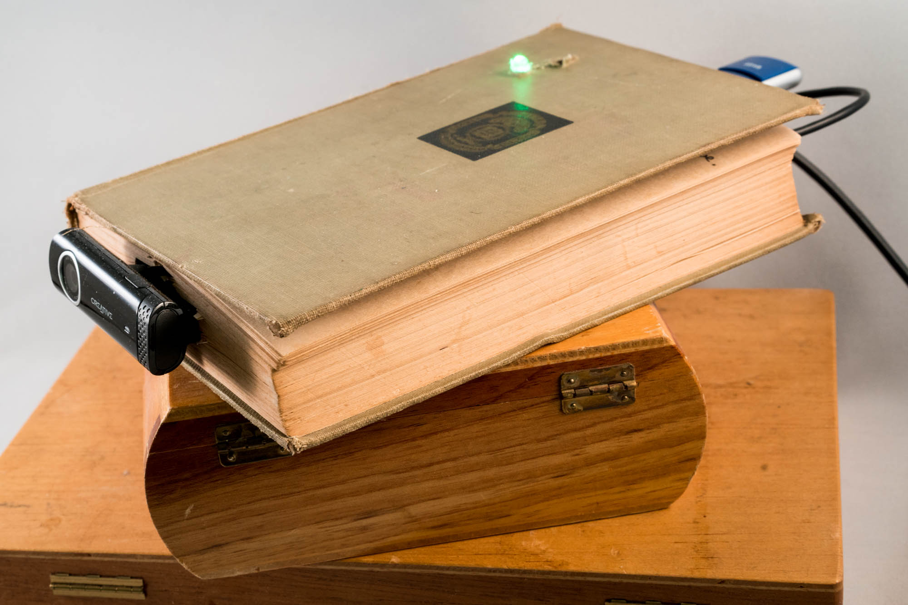
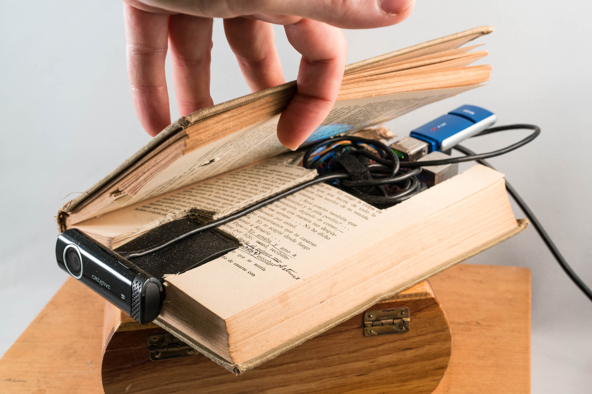
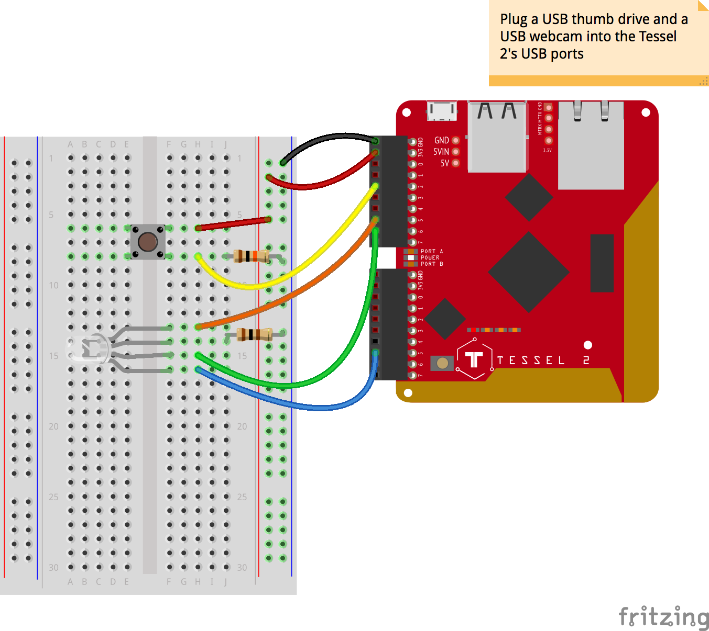

## Introduction

Some time ago, I began to have a hankering to be able to automatically photograph or film the sunrise wherever I may happen to be. I liked the idea of a little machine that could determine when the sun would rise in my location and take some time lapse images of it. Thus was born the idea of a sunrise machine.

The sunrise machine can, based on your latitude and longitude, automatically record the sunrise at your location using a basic USB webcam. It captures still images over time and creates time-lapse movies from them in MPEG-4 and animated-GIF formats. If you choose, it can also tweet those resulting GIFs on your behalf. You can configure it to record different day-sun events—sunset, solar noon, the start of the golden hour, even nautical twilight. You don't have to tweet the results, if that's not your thing, and you can always create a manual time-lapse video at any time by pressing a button. All still images and videos are stored for you on a USB thumb drive.



I built an enclosure for my sunrise machine out of an old book. But you can put yours in whatever you like, or not bother with an enclosure at all.



## Pre-Flight Check

Whoa, there, Turbo! If this is your first time experimenting with the [Tessel 2](https://learn.sparkfun.com/tutorials/experiment-guide-for-the-johnny-five-inventors-kit/about-the-tessel-2), there are a few things you gotta do first:

1. [Set up your computer](https://learn.sparkfun.com/tutorials/experiment-guide-for-the-johnny-five-inventors-kit/software-installation-and-setup)
2. [Configure your Tessel 2](https://learn.sparkfun.com/tutorials/experiment-guide-for-the-johnny-five-inventors-kit/hardware-installation-and-setup)

_Note_: These steps only have to be done once, but they are required.

<div class="alert alert-info"><b>Note:</b> For this guide you will need to have an internet connection and administrative privileges on the computer that you are using.</div>

## Helpful Background Info

The entire [Johnny-Five Inventor's Kit Experiment Guide](https://learn.sparkfun.com/tutorials/experiment-guide-for-the-johnny-five-inventors-kit) is great stuff if you're starting out with the Tessel 2. Pertinent experiments for this tutorial include [Experiment 4: Reading a Push Button](https://learn.sparkfun.com/tutorials/experiment-guide-for-the-johnny-five-inventors-kit/experiment-4-reading-a-push-button) and [Experiment 8: Driving an RGB LED](https://learn.sparkfun.com/tutorials/experiment-guide-for-the-johnny-five-inventors-kit/experiment-8-driving-an-rgb-led).

## Materials

The Johnny-Five Inventor's Kit includes most of the electronic components you need to build the sunrise machine. In addition to the items in the kit, you'll need a USB camera like the [Creative Live! Cam Chat HD (Amazon)](https://www.amazon.com/dp/B004431UBM/ref=pd_lpo_sbs_dp_ss_2?pf_rd_p=1944687662&pf_rd_s=lpo-top-stripe-1&pf_rd_t=201&pf_rd_i=B0092QJRPC&pf_rd_m=ATVPDKIKX0DER&pf_rd_r=6PXCKBP9WH670G3JXZ26) and a USB thumb drive. The full list of needed parts follows:

* 1 Tessel 2\*
* 1 USB thumb drive
* 1 USB camera
* 1 breadboard\*
* 1 pushbutton\*
* 1 common-cathode RGB LED\*
* 7 jumper wires\*
* 1 100Ω resistor\*
* 1 10kΩ resistor\*

\* Included in the highly-recommended [Johnny-Five Inventor's Kit](https://www.sparkfun.com/products/13847).

### Get Twitter Ready

If you'd like your sunrise machine to be able to tweet, you'll need to [obtain Twitter API credentials](https://apps.twitter.com/). You'll have to fill out a little form, but the use of the API is free. Once you're signed up, you'll have access to an API/developer dashboard. You'll need to find the following four things to make your sunrise machine talk to Twitter:

* Consumer Key
* Consumer Secret
* Access Token (Key)
* Access Token (Secret)

Access Token (Key) and Access Token (Secret) may need to be generated (you just to have to click a button to do it). Each of the four credentials are long strings. Copy and paste them somewhere safe.

For my sunrise machine, I created an entirely new Twitter user (link to Twitter) but you can use your main Twitter account if you prefer. Or, if Twitter isn't your thing, you can disable it completely with a configuration value (more on that soon).

### Webcams and Calibration

In the course of building the sunrise machine, I discovered that some webcams require a period of "warmup" before capturing stills so that they can calibrate the correct exposure. This usually takes 2-3 seconds. Without calibration "warmup", images taken of bright scenes—like outside—would result in all-white images. Yikes! The sunrise machine's software can automatically calibrate your webcam before capturing images to help you get the best images possible. You can disable this feature if you like.

### USB and the Tessel

Working with a USB thumb drive and USB camera on a Tessel is eerily easy.

For the thumb drive: make sure it is formatted as Fat32 or something similar (TODO CLARITY). The sunrise machine will write files (images, movies and GIFs) directly to your thumb drive. If you're curious, a mounted USB thumb drive can be accessed at `/mnt/sda1` on the Tessel's file system. Use the `t2 root` command if you want to `ssh` in to your Tessel and have a look around the filesystem—the Tessel 2 runs OpenWRT Linux.

Similarly, plugging in a USB webcam to a Tessel makes the device available at `/dev/video0`.

### The Tessel and Time

The Tessel 2 isn't an independent timekeeper. Once the Tessel has power and its OpenWRT Linux boots, it will attempt to connect to an NTP (Network Time Protocol) server to obtain the current time. There are a couple of things to note about this. One, dates and times on the Tessel are UTC times—it doesn't know about your local timezone. Second, the Tessel can't tell what time it is at all if it does not have a network connection (e.g. if it's only tethered to your computer over USB but is not connected to your LAN). In that case, it will fall back to a hard-coded time, TODO FLESH OUT

The command `t2 list` will show you all nearby Tessels and how they are connected, e.g. for my Tessel, which I've named _ichabod_ after a local early settler of my town named, improbably, Ichabod Onion:

```
$ t2 list
INFO Searching for nearby Tessels...
 	USB	ichabod
 	LAN	ichabod
```

_ichabod_ is, in this case, connected both to my USB port and my local WiFi network. Good. It'll know what time it is. In UTC, at least.

## Build It

Now you're ready to put your sunrise machine's components together.



1. Plug in a USB thumb drive to one of the Tessel 2's USB ports.
2. Plug in a USB webcam to the other USB port on the Tessel 2.
3. Wire up the circuit containing a pushbutton and an RGB LED as shown in the wiring diagram.

## Program It

To run the sunrise machine, you'll need the code. If you're in a hurry, you can get the sunrise machine running by following instructions in the _Setup and Configuration_ section (creating a `config.js` file), grabbing the rest of the code from the [j5ik-sunrise-machine repository](https://github.com/bocoup/j5ik-sunrise-machine) and then skipping to the _Run It!_ section at the end of the tutorial. The rest of the sections here explore how the code works but are not strictly necessary to make the sunrise machine work!

### Setup and Configuration

First, install some dependencies. In your project directory, run the command:

`npm install johnny-five tessel-io suncalc twitter moment`

#### Configuration: `config.js`

The only code changes you'll _need_ to make from the supplied code with the sunrise machine are in its configuration (everything else you can copy and paste if you so choose). Create a file called `config.js` and populate it with the following:

```javascript
module.exports = {
  lat                : 43.34, // Your latitude (This is Vermont)
  long               : -72.64, // Your longitude (This is Vermont)
  utcOffset          : '-04:00', // Your timezone relative to UTC
  autoSchedule       : 'sunrise', // Any property from `suncalc` or `false` to disable
  postToTwitter      : true, // `true` will create posts of GIFs
  tweetBody          : 'It is a beautiful day!', // Text tweeted with GIFs
  consumer_key       : '', // Twitter
  consumer_secret    : '', // Twitter
  access_token_key   : '', // Twitter
  access_token_secret: '', // Twitter
  captureFrequency   : 30, // in seconds (default one image every 30s)
  captureCount       : 20, // number of stills per montage
  calibrateCamera    : 3, // length of camera calibration (default 3s)
  statusLED          : true, // Enable RGB status LED? false will turn it off
  basedir            : '/mnt/sda1/captures', // where files get stored
  dateFormat         : 'ddd MMM DD, YYYY HH:mm:ss',
};
```

This configuration object is organized such that the properties you're most likely to change are near the top.

* You'll want to change, at the very least, the **`lat` and `long` values** to the coordinates of [where you are located](http://www.latlong.net/).
* To account for the Tessel 2's proclivity for UTC, you can provide a `utcOffset` value. `-04:00` is the offset for daylight savings time on the east coast of the U.S. (EDT)—four hours "behind" UTC. This setting isn't critical—the dates used by the Tessel to figure out to record will still be accurate, but if you want logging and folder names for your images and movies to use your local time zone (i.e. not UTC), change this value.
* `autoSchedule` can be set to any of [suncalc's sun event names](https://github.com/mourner/suncalc#sunlight-times), or can be set to `false` to disable scheduled recording (you can always trigger manual movies by pressing the sunrise machine's pushbutton).
* If you enable `postToTwitter`, you'll need to fill in the Twitter API credentials that follow.
* I encourage you to experiment with the value of `calibrateCamera`. If you find that your camera is taking great stills without calibration, you can save power and time by disabling calibration (set this property to `0` or `false` to turn it off).
* You can disable the `statusLED` if you like. This can save power and your nerves if you find the light or blinking annoying (or it is reflecting off a window during capture or something).

### Sunrise Machine's Dependencies and Components

When the sunrise machine's code is complete, your project directory will look like this:

```
├── av.js
├── config.js
├── node_modules
├── recording.js
├── index.js
└── tweet.js
```

`config.js` is the configuration file you just created. `node_modules` is where the project's dependencies—installed above—live.

The other components of the sunrise machine are:

* `tweet.js`, which integrates with the Twitter API and can upload animated GIFs
* `recording.js`, which provides a class that encapsulates the tasks of a time-lapse recording session (scheduling still capture, kicking off the processing of stills into movies, etc.)
* `av.js`, which contains lower-level code to execute the capture and processing of images and video
* `index.js`, which is the code that controls the Tessel's inputs and outputs and pulls it all together

### Capturing and Processing Video with the Tessel 2: `av.js`

The image capture, video building and animated-GIF creating powers of the sunrise machine are significantly influenced by the existing [`tessel-av`](https://github.com/tessel/tessel-av) module, which is a great starting place for grabbing still images or streaming video. Like `tessel-av`, the sunrise machine's code takes advantage of the cross-platform [`ffmpeg` software](https://ffmpeg.org/), which is available for you already on your Tessel. No installation or configuration needed!

`ffmpeg` is a hugely-powerful command-line tool that can encode and decode (and transcode and mux and demux and stream and filter and play and and and) a dizzying array of different kinds of audio and video. Just learning how to put together commands to do simple video capture and storage can take a while (trust me).

Keep in mind that the Tessel 2 is able to do all this despite its mere _64MB of RAM_. It's quite a trooper.

`av.js` spawns `ffmpeg` processes using Node.js' built-in `child_process` module. The `av` module contains an appropriately-titled `ffmpeg` function. The `ffmpeg` function spawns an `ffmpeg` child process with the arguments provided and returns a `Promise`:

```javascript
    function ffmpeg (opts) {
      opts.unshift('-v', 'fatal'); // Comment this line to see ffmpeg logging
      const ffmpegProcess = cp.spawn('ffmpeg', opts);
      return new Promise((resolve, reject) => {
        ffmpegProcess.on('exit', code => {
          if (code != 0) {
            console.error(code);
            reject(code);
          } else {
            resolve();
          }
        });
        ffmpegProcess.stderr.on('data', data => {
          console.log(data.toString()); // Logging when not suppressed
        });
      });
    }
```

Each of the four exported functions (`calibrate`, `captureStill`, `videoFromStills` and `animatedGIFFromVideo`) are intended to fulfill one AV task by invoking the `ffmpeg` function with the needed arguments. These functions also return a Promise. Here's a condensed view of the rest of the `av.js` module:

```javascript
    // "Calibrate" a camera for `duration` seconds by letting it output to /dev/null
    module.exports.calibrate = function (duration) {
      const videoArgs = [ /* ffmpeg arguments needed to calibrate camera */ ];
      return ffmpeg(videoArgs).then(() => '/dev/null');
    };

    // Capture a single still image at 320x240 from the attached USB camera
    module.exports.captureStill = function (filepath) {
      const captureArgs = [ /* ffmpeg arguments needed to capture a still */];
      return ffmpeg(captureArgs).then(() => filepath);
    };

    // Build an MP4 video from a collection of JPGs indicated by `glob`
    module.exports.videoFromStills = function (glob, outfile) {
      const stillArgs = [ /* ffmpeg arguments needed to create a video from stills */];
      return ffmpeg(stillArgs).then(() => outfile);
    };

    // Create an animated GIF from an MP4 video. First, generate a palette.
    module.exports.animatedGIFFromVideo = function (videofile, outfile) {
      const paletteFile = '/tmp/palette.png';
      const paletteArgs = [ /* arguments needed to create a color palette */ ];
      return ffmpeg(paletteArgs).then(() => {
        const gifArgs = [ /* arguments needed to create an animated GIF */ ];
        return ffmpeg(gifArgs).then(() => outfile);
      });
    };
```

Arguments are cobbled together in each function. Here's the entirety of the `captureStill` function, for instance:

```javascript
    // Capture a single still image at 320x240 from the attached USB camera
    module.exports.captureStill = function (filepath) {
      const captureArgs = [
        '-y', // Overwrite
        '-s', '320x240', // maximum resolution the Tessel 2's memory can handle
        '-r', '15', // Framerate
        '-i', '/dev/video0', // Mount location of video camera
        '-q:v', '2', // Quality (1 - 31, 1 is highest)
        '-vframes', '1', // Total number of frames in the "video"
        filepath
      ];
      return ffmpeg(captureArgs).then(() => filepath);
    };
```

Note that the `animatedGIFFromVideo` function is a two-step process that first creates a palette from a movie and subsequently creates an animated GIF from the movie based on that palette. GIFs are restricted to 256 colors, so using an intelligently-generated palette can result in a higher-quality GIF.

You can see the full [source of `av.js` here](av.js).

### Tweeting Animated GIFS: `tweet.js`

`tweet.js` uses the `twitter` `npm` package to communicate with the Twitter API, making the several API calls necessary to upload an animated GIF. Once the GIF is uploaded, it posts a tweet containing the GIF. It exports a function, `tweetGIF(config, filepath, tweetBody)` where `config` is an object that contains Twitter credentials, `filepath` is a path to the animated GIF and `tweetBody` is the text content of the tweet to post. `index.js` can call this function to tweet a GIF.

You can see the [source of `tweet.js` here](tweet.js).

### Taking Care of Details: `recording.js`

The JavaScript `class` exported by `recording.js`, `Recording`, encapsulates some of the tasks of managing a time-lapse recording session, like naming of files and managing timeouts between captures. A `Recording` instance can be started with its `start` method and canceled with its `cancel` method. The `Recording` handles the rest, invoking specific functions in the `av` module to accomplish tasks like calibration, capturing stills and building movies and GIFs.

You can see the [source of `recording.js` here](recording.js)

### Where it all Happens: `sunrise.js`

We've met the supporting cast. Now let's walk through, in entirety, `index.js`, which is the script you'll run directly on your Tessel to make the sunrise machine go! Here it is, with lots of comments.

```javascript
    /* require external dependencies */
    const five      = require('johnny-five'); // Johnny-Five!
    const Tessel    = require('tessel-io'); // J5 I/O plugin for Tessel boards
    const suncalc   = require('suncalc'); // For calculating sunrise/set, etc., times
    const Moment    = require('moment'); // For wrangling Dates because otherwise ugh
    // Require other modules from sunriseMachine's code:
    const config    = require('./config');
    const Recording = require('./recording');
    const tweetGIF  = require('./tweet');

    // Instantiate a new `Board` object for the Tessel
    const board = new five.Board({
      io: new Tessel() // Use the Tessel-IO plugin
    });

    // Instantiate some variables for later
    var currentRecording, scheduled;

    board.on('ready', () => { // Here we go. The board is ready. Let's go!
      // Instantiate J5 component objects: a pushbutton and RGB status LED
      const button    = new five.Button('A2');
      const statusLED = new five.Led.RGB(['A5', 'A6', 'B5']);
      // When the button is `press`ed, invoke the `toggle` function
      button.on('press', toggle);
      // Put the sunrise machine in standby mode
      standBy();

      // Put the sunrise machine in standby. Schedule the next recording if needed
      function standBy () {
        currentRecording      = null;       // There is no active recording. Explicitly.
        const scheduleDetails = schedule(); // See if there is a recording to schedule
        // `scheduled` is a Timeout object if there is a scheduled recording
        // if it's falsey, there is nothing scheduled, so put the SM in regular standby
        const nextStatus      = (scheduled) ? 'scheduled' : 'standby';
        // Set the sunrise machine's status and log any message returned by
        // the schedule function
        setStatus(nextStatus, scheduleDetails);
      }

      // button `press` callback. Start a manual recording, or cancel an in-progress recording
      function toggle () {
        if (currentRecording) { // if currentRecording is truthy, there is an in-progress recording
          currentRecording.cancel(); // so, cancel it
        } else { // otherwise, start a new recording
          record('Manual recording');
        }
      }

      function schedule () { // Schedule to record next autoSchedule event
        if (!config.autoSchedule) { // auto-scheduling is disabled in config
          return 'Nothing to schedule! Sunrise machine in auto mode';
        }
        const eventName    = config.autoSchedule;
        const now          = Moment();
        // Using noon explicitly when querying about sun events adds a level
        // of safety; using times near the start or end of the day can kick up
        // some unexpected results sometimes.
        const noonToday    = Moment().hour(12).minute(0);
        const noonTomorrow = Moment().add(1, 'days').hour(12).minute(0);

        // Ask `suncalc` for the times of various sun events today, at the
        // lat/long defined in the config
        var sunEvents = suncalc.getTimes(noonToday.valueOf(),
          config.lat, config.long);
        var eventDate, delta;

        if (!sunEvents.hasOwnProperty(eventName)) { // Invalid value for config.autoSchedule
          return `Not scheduling: ${eventName} is not a known suncalc event`;
        }

        if (sunEvents[eventName].getTime() < now.valueOf()) {
          // The event has already happened for today. Check when tomorrow's is...
          sunEvents = suncalc.getTimes(noonTomorrow.valueOf(),
            config.lat, config.long);
        }

        // Using the config.utcOffset value to bring the date into local timezone
        // Note that the actual date underneath is not changing, just its representation
        eventDate = Moment(sunEvents[eventName]).utcOffset(config.utcOffset);
        // How long is the event from now, in milliseconds?
        delta = eventDate - now;
        if (!scheduled) { // Don't reschedule if already scheduled
          // Schedule the recording by setting a timeout for the number of milliseconds
          // until the event
          scheduled = setTimeout(() => {
            record(`Automatic ${eventName} recording`); // Kick off a recording
            scheduled = null; // Unset scheduled because we're done here
          }, delta);
        }
        return `Scheduled for ${eventName}: ${eventDate.format(config.dateFormat)}`;
      }

      // Kick off a time-lapse recording!
      function record (name) {
        if (currentRecording) {
          log('Another recording session already in progress');
          return false;
        }
        // Create a new Recording object to do some heavy lifting for us
        const recording = new Recording(name, config);
        // Bind to a bunch of events on the Recording. Several of these update
        // the SM's status and/or log a message:
        recording.once('start', () => {
          setStatus('recording', `${recording.name} starting`);
        });
        recording.on('calibrate', () => setStatus('calibrating'));
        recording.on('capture:start', () => setStatus('capturing'));
        recording.once('cancel', () => log(`${recording.name} canceled`));

        // When one of the stills in a session is successfully captured, take note!
        recording.on('capture:done',  (filepath, images, totalnum) => {
          setStatus('recording',
            `Oh, snap! Captured ${images.length} of ${totalnum}`);
        });
        // When the stills are captured and the movies made, Tweet the result
        // if config indicates it should be done
        recording.once('done', videoFile => {
          if (config.postToTwitter) {
            tweetGIF(config, videoFile, config.tweetBody);
          }
          log(`${recording.name} complete`);
        });
        // Once the Recording exits, put the SM back in standby (this will
        // cause the next recording to get scheduled, if needed)
        recording.once('exit', standBy);

        // Start the recording!
        recording.start();

        // Reference this Recording as the SM's currentRecording
        currentRecording = recording;
        return recording;
      }

      // Indicate the sunrise machine's "status" by changing the state of the
      // RGB LED and optionally logging a message
      function setStatus (status, msg) {
        if (!config.statusLED) return; // Leave it alone if it's not enabled
        statusLED.stop().on(); // Stop any blinking that may be going on
        switch (status) {
          case 'standby':
            statusLED.color('blue');
            break;
          case 'scheduled':
            statusLED.color('green');
            break;
          case 'recording':
            statusLED.color('yellow');
            break;
          case 'calibrating':
            statusLED.color('orange').blink(500);
            break;
          case 'capturing':
            statusLED.color('red').blink(250);
            break;
          default:
            // Hmmm, I don't understand this status :)
            statusLED.color('purple').blink(1000);
            break;
        }
        if (msg) {
          log(msg);
        }
      }

      // This log function could be altered to log to a file, e.g.
      function log (msg) {
        const now = Moment().utcOffset(config.utcOffset).format(config.dateFormat);
        console.log(`${now}:
          ${msg}`);
      }
    });
```

## Run It!

Run the sunrise machine by using the following command:

`$ t2 run index.js`

That will deploy the `index.js` code and all of its needed dependencies to your Tessel.
